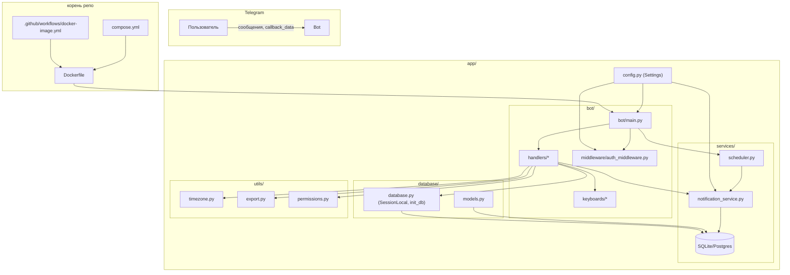

## Техническая документация

Этот файл описывает внутреннюю структуру бота, основные модули и связи между ними.

---

### Структура каталогов (укрупнённо)

```text
bot/
├── app/
│   ├── bot/
│   │   ├── handlers/
│   │   │   ├── common_handlers.py       # /start, главное меню, отчёты
│   │   │   ├── admin_handlers.py        # админ‑панель, события, регистрации, пользователи
│   │   │   ├── assistant_handlers.py    # функции помощников
│   │   │   ├── user_handlers.py         # пользовательские сценарии (просмотр/регистрация/отмена)
│   │   │   ├── event_management.py      # FSM редактирования событий
│   │   │   ├── settings_handlers.py     # глобальные настройки и шаблоны уведомлений
│   │   │   └── notification_handlers.py # управление уведомлениями на уровне события
│   │   ├── keyboards/
│   │   │   ├── common_keyboards.py      # главное меню и общие клавиатуры
│   │   │   ├── admin_keyboards.py       # клавиатуры админ‑панели
│   │   │   └── assistant_keyboards.py   # клавиатуры помощников
│   │   ├── middleware/
│   │   │   └── auth_middleware.py       # авторизация, загрузка/создание пользователей из БД
│   │   └── main.py                      # точка входа бота (aiogram + APScheduler)
│   ├── api/
│   │   └── main.py                      # FastAPI‑приложение (опционально, под mini‑app)
│   ├── database/
│   │   ├── models.py                    # SQLAlchemy‑модели (User, Event, Registration, ...)
│   │   ├── database.py                  # SessionLocal, init_db
│   │   └── migrations/                  # Alembic‑миграции
│   ├── services/
│   │   ├── notification_service.py      # создание ScheduledNotification, отправка уведомлений
│   │   └── scheduler.py                 # APScheduler, периодический опрос очереди
│   ├── utils/
│   │   ├── timezone.py                  # get_local_now, utc_to_local, parse_local_datetime, формат дат
│   │   ├── export.py                    # экспорт регистраций в CSV/Excel
│   │   └── permissions.py               # проверка ролей (is_admin, и т.д.)
│   ├── config.py                        # pydantic‑настройки (BOT_TOKEN, ADMIN_USER_IDS, TIMEZONE, ...)
│   ├── example.env                      # шаблон .env
│   └── run.sh                           # локальный запуск бота + API
├── Dockerfile                           # образ бота
├── compose.yml                          # docker-compose сервис mclassbot
├── requirements.txt                     # зависимости
├── README.md                            # основная документация и запуск
└── DOCS.md                              # этот файл
```

---

### Диаграмма структуры (под катом)

<details>
<summary>Показать диаграмму модулей и связей</summary>



</details>

---

### Основные потоки

- **Запуск бота**: `bot/main.py`
  - читает настройки из `config.py`,
  - инициализирует БД через `database/database.py`,
  - регистрирует middleware и handlers,
  - запускает планировщик из `services/scheduler.py`,
  - стартует `Dispatcher.start_polling`.

- **Регистрация пользователя и ролей**: `middleware/auth_middleware.py`
  - по каждому апдейту читает/создаёт `User` в БД,
  - определяет роль на основе `settings.admin_ids`,
  - прокидывает `user` и `db` в handlers.

- **Регистрация на событие**: `user_handlers.py` + `admin_handlers.py`
  - пользователи регистрируются на события, создаются `Registration`,
  - при регистрации вызывается `create_scheduled_notifications_for_event` в `notification_service.py`.

- **Уведомления**: `services/scheduler.py` + `services/notification_service.py`
  - по таймеру выбираются `ScheduledNotification` из БД,
  - время рассчитывается через `utils/timezone.py`,
  - сообщения отправляются пользователям от имени бота.

---

Для детального разбора конкретного сценария (создание события, экспорт, права доступа и т.п.) можно ориентироваться на соответствующий handler в `bot/handlers/` и смотреть, какие сервисы/утилиты он вызывает согласно диаграмме выше.


